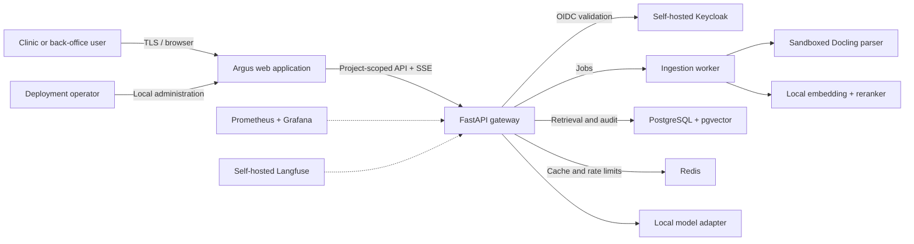
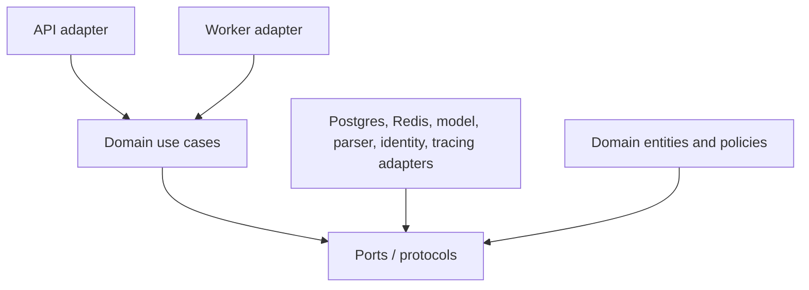
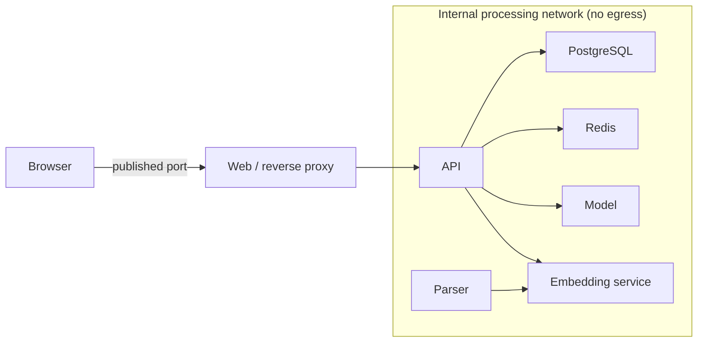
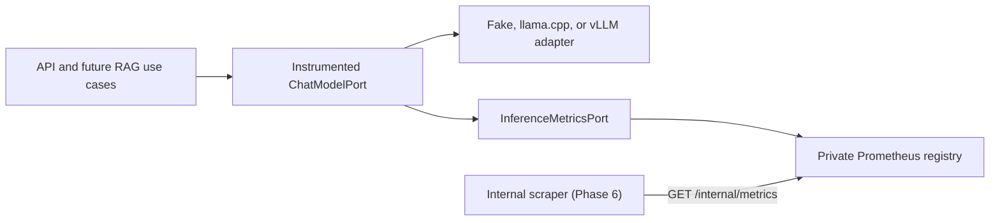

# Architecture

## System context

There are no external AI services or processing-container egress paths.
Keycloak, model serving, parsing, observability, and storage all run within the
operator-controlled deployment.

## Backend containers and dependency direction

The arrows represent compile-time dependencies. Domain code never imports
adapters, web frameworks, database clients, or model engines.

## Runtime networks

Phase 0 provisions the web, API, PostgreSQL, and Redis boundaries. Phase 1 adds
isolated llama.cpp CPU and vLLM GPU runtimes behind the provider-neutral model
adapter, the internal BGE retrieval gateway and workers, and provider-neutral
inference instrumentation. Later phases fill the remaining reserved service
locations.

## Inference telemetry boundary

The decorator measures every configured chat provider through one domain
contract. Terminal chunks may carry normalized input/output token usage, while
provider payloads remain inside infrastructure adapters. Only the fixed
provider set, a validated configured model name, bounded outcomes, and bounded
finish reasons can become metric labels. Prompts, outputs, request metadata,
document identifiers, user identifiers, and exception messages never enter the
metrics port.

The API owns a private Prometheus registry and exposes it only at the backend's
`/internal/metrics` path. The backend has no published host port, and the web
proxy denies the entire `/api/internal/` namespace. Prometheus/Grafana service
provisioning and dashboards remain Phase 6 work.

## Data lifecycle

Project identity is the mandatory partition key for documents, chunks, vectors,
and caches. Persistent projects use encrypted operator-managed volumes.
Ephemeral projects parse raw files in tmpfs and do not persist the upload. The
idempotent deletion workflow introduced in Phase 5 removes every content-bearing
artifact before recording completion in the metadata-only audit log.
